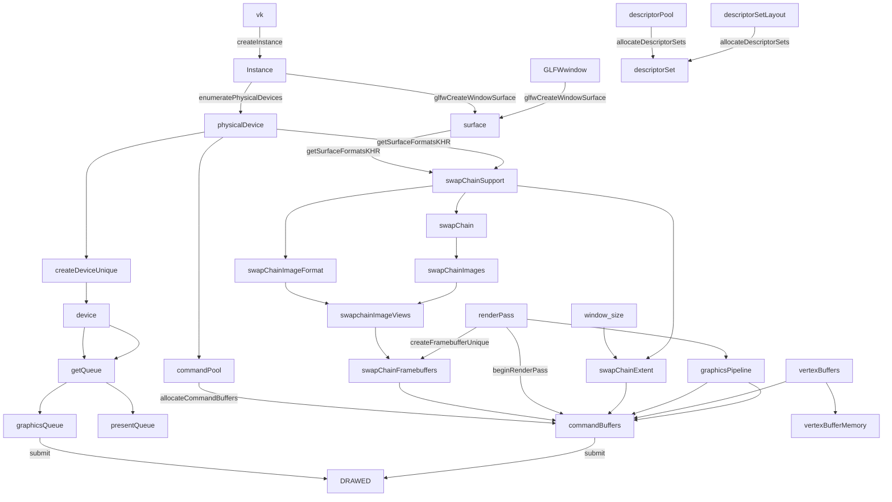
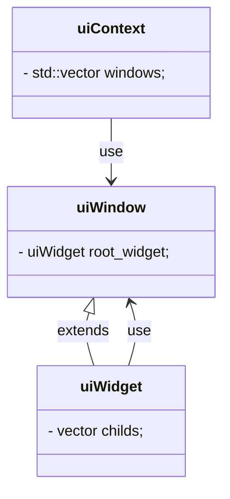

# Vulkan Graphics User Interface

## structures

```mermaid
flowchart TD

GLFWwindow
vk--createInstance-->Instance
Instance --glfwCreateWindowSurface--> surface
GLFWwindow --glfwCreateWindowSurface--> surface
Instance --enumeratePhysicalDevices--> physicalDevice
physicalDevice-->createDeviceUnique--> device
device-->getQueue--> graphicsQueue
device-->getQueue--> presentQueue
surface--getSurfaceFormatsKHR-->swapChainSupport
physicalDevice--getSurfaceFormatsKHR-->swapChainSupport
swapChainSupport--> swapChain
swapChain--> swapChainImages
swapChainSupport --> swapChainImageFormat
window_size-->swapChainExtent
swapChainSupport-->swapChainExtent
swapChainImageFormat-->swapchainImageViews
swapChainImages--> swapchainImageViews
swapchainImageViews-->swapChainFramebuffers
renderPass--createFramebufferUnique-->swapChainFramebuffers
renderPass-->graphicsPipeline
physicalDevice-->commandPool
commandPool--allocateCommandBuffers-->commandBuffers
swapChainFramebuffers-->commandBuffers
renderPass--beginRenderPass-->commandBuffers
swapChainExtent-->commandBuffers
graphicsPipeline-->commandBuffers
vertexBuffers-->commandBuffers
vertexBuffers-->vertexBufferMemory
graphicsPipeline-->commandBuffers
graphicsQueue--submit-->DRAWED
commandBuffers--submit-->DRAWED

descriptorPool--allocateDescriptorSets-->descriptorSet
descriptorSetLayout--allocateDescriptorSets-->descriptorSet
```

```mermaid
classDiagram
class uiContext {
    - std::vector<uiWindow> windows;
}

class uiWindow {
	- uiWidget root_widget;
}

class uiWidget {
	- vector<uiWidget> childs;
}

uiWindow <|-- uiWidget : extends
uiContext --> uiWindow : use
uiWidget --> uiWindow : use
```

かくのあきた

##  TODO

- 複数Windowへの対応

